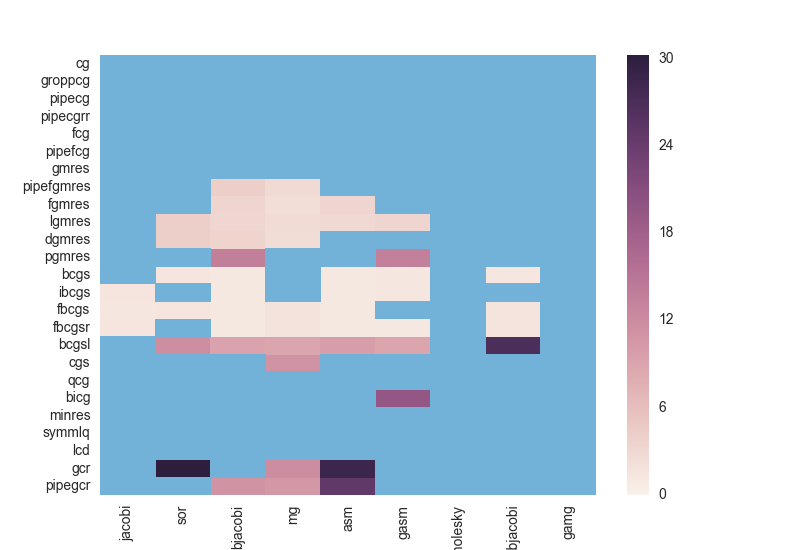
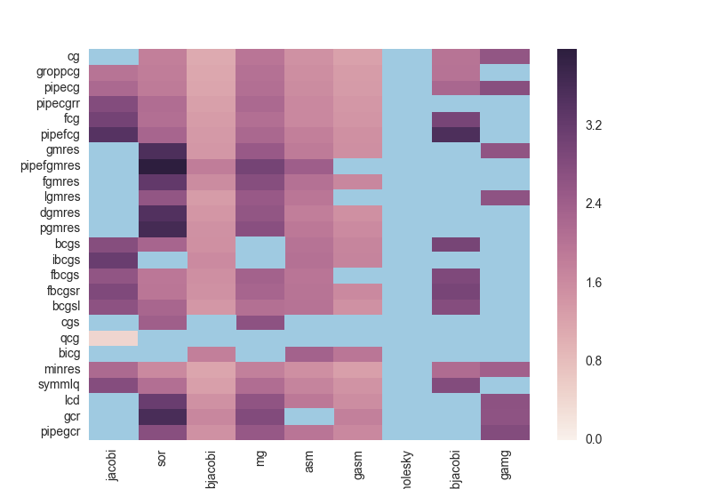

# Homework 3

## Local Analysis

```
Number of MPI processes 1 Processor names  ged.local
Triad:        14030.7054   Rate (MB/s)
Number of MPI processes 2 Processor names  ged.local ged.local
Triad:        14760.0144   Rate (MB/s)
Number of MPI processes 3 Processor names  ged.local ged.local ged.local
Triad:        14142.1919   Rate (MB/s)
Number of MPI processes 4 Processor names  ged.local ged.local ged.local ged.local
Triad:        13918.9239   Rate (MB/s)
------------------------------------------------
np  speedup
1 1.0
2 1.05
3 1.01
4 0.99
```

Unsurprisingly, there isn't much speedup on my laptop from using multiple MPI processes.

### `ex19`

I ran a little program that runs every combination or krylov method and
preconditioner from a given set and records their results.



Blue indicates that the given KSP - PC combination ran too slowly or did not converge.

`bcgs` and `gmres` methods appear to preform the best. The preconditioners appear to be about the same in terms of performance.

### `ex48`

I used that same script for `ex48`.



Almost all of the krylov solvers do pretty well on this problem. `bjacobi` and `gasm` appear to be the best preconditioners.

## On Janus

### `make streams`

```
np  speedup
1 1.0
2 1.28
3 1.35
4 1.51
5 1.46
6 1.47
7 1.48
8 1.85
9 1.51
10 2.1
11 2.22
12 2.31
```

Look like 10-12 processors works the best here.

### `ex19`

I'm going to use `pipefgmres` and `bcgs` for this problem. The preconditioners will be `asm` and `bjacobi`.

Guess at problem size in 5 minutes: 2000 x 2000.

Actual times:

- `bcgs` and `asm`: 4.218e+02 seconds or 7.03 minutes for 1000x1000.
- `bcgs` and `bjacobi`: 4.511e+02 seconds or 7.5 minutes for 1000x1000.
- `pipefgmres` and `asm`: 3.805e+02 seconds or 6.34 minutes for 600x600.
- `pipefgmres` and `bjacobi`: 4.369e+02 seconds or 7.28 minutes for 600x600.

So I was pretty far off on this one.

### `ex48`

I'm going to use `cg` and `gmres` with `gasm` and `bjacobi`.

It will probably be around 750x750 in 5 minutes.

- `cg` and `bjacobi` on 400x400 grid: 5.197e+02 seconds or 8.66 minutes.
- `cg` and `gasm` on 400x400 grid: 4.970e+02 seconds or 8.28 minutes.
- `gmres` and `gasm` on 300x300 grid: 4.897e+02 seconds or 8.16 minutes.
- `gmres` and `bjacobi` on 300x300 grid: 4.855e+02 seconds or 8.09 minutes.

Once again I was pretty far off.
